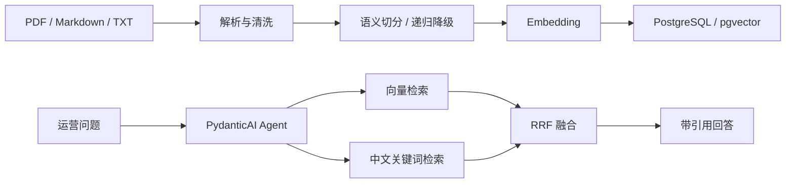

# 电商运营知识 RAG Agent

面向商品资料、平台规则、内容规范、运营 SOP 与历史案例的可追溯问答系统。项目基于 Serkan Yaşar 的 MIT 开源 `ntt_rag_project` 深度二次开发，保留 FastAPI、PydanticAI、PostgreSQL/pgvector 与 Streamlit 主体，并新增中文混合检索、结构化引用、多格式摄取和离线评测。

> 本项目是单 Agent 多工具的 Agentic RAG，不宣称为多 Agent 系统。`documents_demo` 全部为虚构演示资料。

## 核心能力

- PDF、Markdown、TXT 文档加载
- 语义切分与递归切分降级
- pgvector 向量召回
- pg_trgm + ILIKE 中文关键词召回
- Reciprocal Rank Fusion 排名融合
- 向量检索、混合检索、全文读取、文档浏览四类 Agent 工具
- 普通问答和 SSE 流式问答
- 文档、页码、片段、分数和检索方式 citations
- PostgreSQL 会话与消息持久化
- Recall@K、MRR、引用覆盖率与响应时间评测
- 明文密钥扫描

## 架构



## 快速启动

要求：Python 3.12、uv、Docker Desktop。

```powershell
Copy-Item .env.example .env
uv sync
docker compose up -d postgres
uv run python -m ingestion.ingest --documents documents_demo --sql-schema-path sql/schema.sql
uv run uvicorn agent.api:app --host 0.0.0.0 --port 8058
uv run streamlit run ui/app.py
```

在 `.env` 中填写 OpenAI-compatible 配置：

```dotenv
LLM_API_KEY=
LLM_BASE_URL=https://api.openai.com/v1
LLM_MODEL=gpt-4o-mini
EMBEDDING_API_KEY=
EMBEDDING_BASE_URL=https://api.openai.com/v1
EMBEDDING_MODEL=text-embedding-3-small
EMBEDDING_DIMENSION=1536
```

LLM 与 Embedding 可以使用不同服务。Embedding 维度必须与数据库 Schema 一致。

## API

- `GET /health`：健康检查
- `POST /chat`：普通问答
- `POST /chat/stream`：SSE 流式问答
- `POST /search/vector`：向量检索
- `POST /search/hybrid`：RRF 混合检索
- `GET /documents`：知识库文档
- `GET /sessions/{session_id}`：会话信息

普通问答会返回 `message/answer`、`session_id`、`tools_used` 和 `citations`。每条 citation 包含文档、页码、证据片段、得分与检索方式。

## 测试与评测

```powershell
uv run pytest -q
uv run python -m evaluation.run_evaluation --dataset evaluation/dataset.json --mode fixture
uv run python scripts/security_scan.py
```

fixture 评测只验证评测管线与指标计算，不代表真实模型效果。真实效果必须配置模型和数据库后重新测量。

## 二次开发边界

上游已有：PydanticAI Agent、FastAPI、pgvector、PDF 摄取、会话持久化、Streamlit、Docker Compose。

本次新增/重构：

- 电商运营业务定位与演示知识库
- OpenAI-compatible 独立 LLM/Embedding 配置
- Markdown/TXT 加载与来源元数据
- 中文 pg_trgm 检索与 RRF 融合
- citations 模型、检索追踪与 SSE final 事件
- 最近会话窗口查询修正
- Recall@K、MRR、引用覆盖率评测
- 安全扫描、中文文档和来源说明

完整上游信息见 [UPSTREAM.md](UPSTREAM.md)，许可证见 [LICENCE](LICENCE)。

## 项目真实性说明

- 不使用虚构准确率或性能提升数据。
- fixture 模式结果不能写成真实检索效果。
- 未配置真实 API 时，能验证单元测试、指标计算、Schema 和安全扫描；真实问答需额外进行集成测试。
